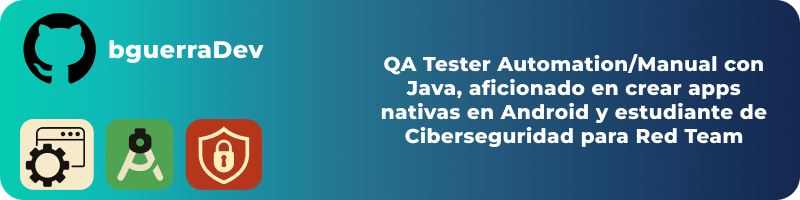

<!-- Banner -->

  

<h1 align="center">Hi 👋 I'm Bryan Guerra</h1>

  QA Engineer | Android Developer | Future Red Teamer 🛡️

  

---

### 👨‍💻 About Me

- 🔎 QA Automation/Manual with **Java + Selenium + Cucumber/Gherkin**
- 🐍 Learning **Python** to enhance automation skills
- 👾 Cybersecurity student focusing on **Red Team / Pentesting**
- 📱 Passionate about creating native Android apps in **Java** (and learning **Kotlin**)
- 🧠 Lifelong learner

---

### 🧰 Tech Stack

#### **Languages**

#### **Frontend**

#### **Backend**

#### **Databases & Cloud**

#### **QA Automation**

#### **Cybersecurity**

---

## 📊 GitHub Stats

<!-- Row 1 -->

  <!-- Stats -->
  
  <!-- Streak -->
  

<!-- Row 2 -->

  <!-- Most used languages -->
  
  <!-- LATEST-PROJECT:START -->

<!-- LATEST-PROJECT:END -->

---

## 📁 Latest Repositories

  <!-- LATEST-REPOS-PINS:START -->

  
  

  
  

<!-- LATEST-REPOS-PINS:END -->

---

### 🤝 Connect with me

- 💼 [LinkedIn](https://www.linkedin.com/in/bryan-fabrizzio-guerra-cobos-a3255332b)
- 📫 bguerradev@outlook.com

---

🧠 *"Break stuff, learn stuff, secure stuff."*